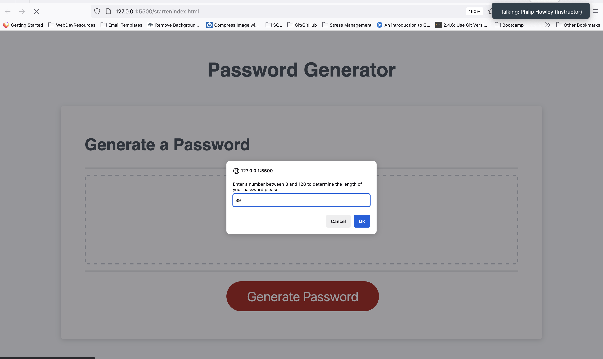

# Password Generator App

A simple web application for generating secure passwords from userinput.

## Table of Contents

- [Description](#description)
- [Features](#features)
- [Installation](#installation)
- [Usage](#usage)
- [Screenshots](#screenshots)
- [Contributing](#contributing)
- [License and Usage](#license-and-usage)

## Description

The Password Generator App is a web tool that allows users to generate strong and secure passwords based on their specified length. Users can determine the length of the password and the generator will include lowercase letters, uppercase letters, numeric digits, and special characters.

## Features

- **User Input:** Prompt users to enter the desired length for the password.
- **Validation:** Ensure the password length is between 8 and 128 characters and that only numeric values are accepted.
- **Random Number Generation:** Utilize a function to generate random numbers within a given range.
- **Character Type Arrays:** Create arrays for lowercase, uppercase, numeric, and special characters.
- **Random Character Selection:** Use the random function to access individual character arrays randomly.
- **Password Generation:** Populate the password with random characters from each selected character type.
- **Web Display:** Output the generated password on the webpage.

## Installation

1. Clone the repository to your local machine using the following command:

   ```bash
   git clone https://timatoyo.github.io/password-generator/

## Usage

1. Open the `index.html` file in your preferred web browser.
2. Open the web application in your browser.
3. Enter the desired length for the password when prompted.
4. Click the "Generate Password" button.
5. Copy the generated password for your use.

## Screenshots




## Contributing

Contributions are welcome! If you have any suggestions, improvements, or bug fixes, please open an issue or submit a pull request.

## License and Usage

This project is licensed under the MIT License. Feel free to use, modify, and distribute the code in accordance with the terms specified in the license.


